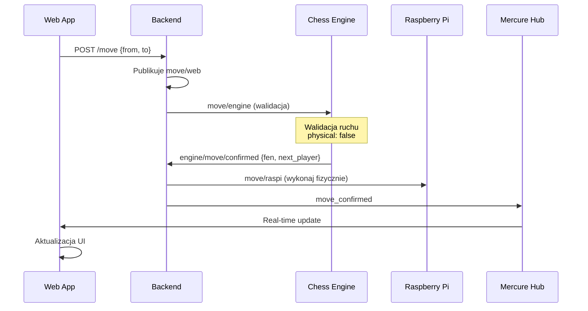
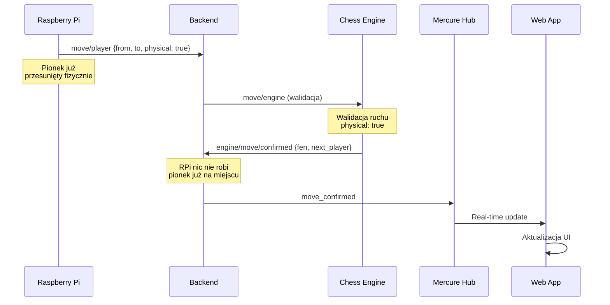
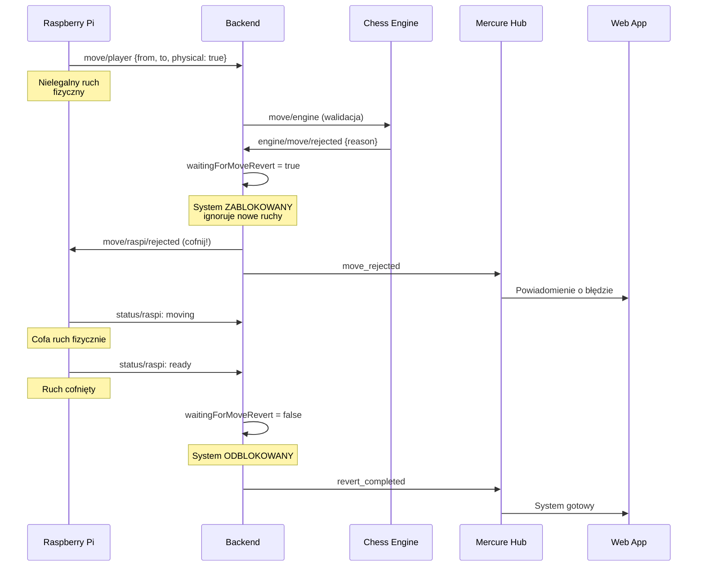
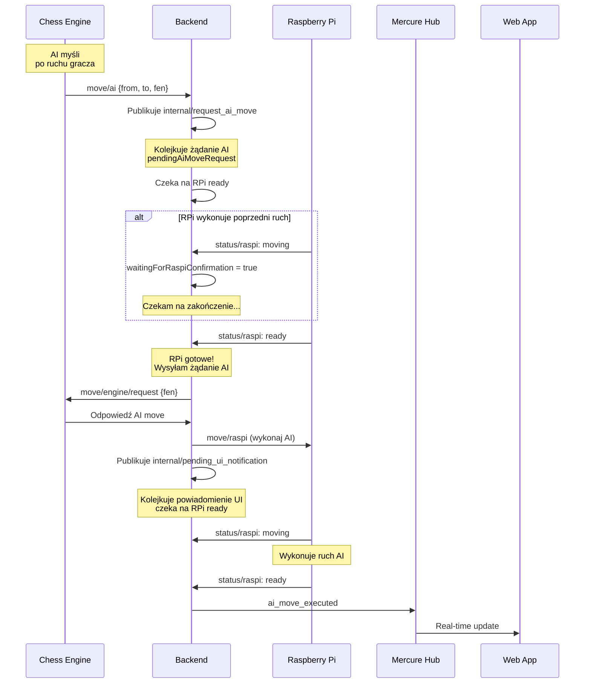
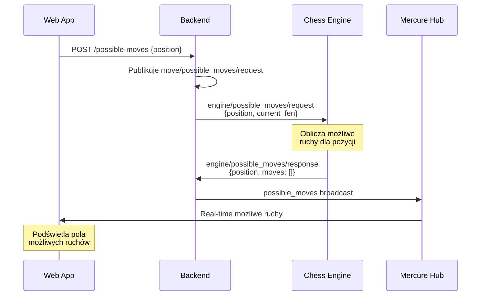
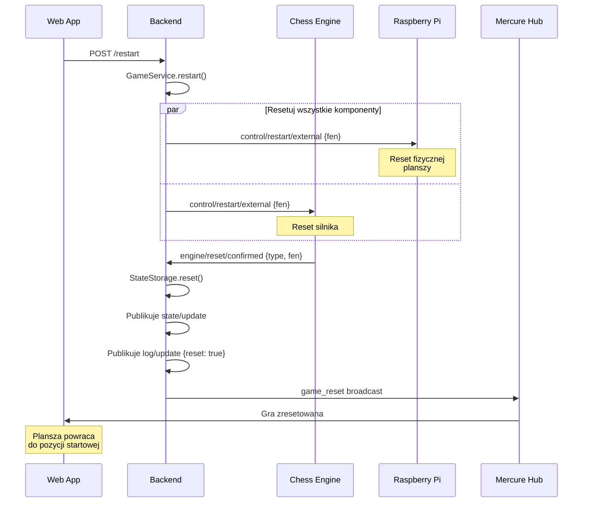

# Symfony Chess Backend

System backendu dla inteligentnej szachownicy opartej na Raspberry Pi z silnikiem szachowym AI. Backend zarządza komunikacją między aplikacją webową, fizyczną szachownicą i silnikiem szachowym poprzez protokół MQTT oraz dostarcza REST API i powiadomienia real-time przez Mercure.

## 📖 Spis treści

-   [🚀 Funkcjonalności](#-funkcjonalności)
-   [🏗️ Architektura systemu](#-architektura-systemu)
-   [📋 Wymagania](#-wymagania)
-   [🛠️ Instalacja](#-instalacja)
-   [🎮 Użytkowanie](#-użytkowanie)
-   [📊 Monitorowanie](#-monitorowanie)
-   [🐛 Debugowanie](#-debugowanie)
-   [📡 Dokumentacja komunikacji MQTT](#-dokumentacja-komunikacji-mqtt)
-   [🔄 Przepływ walidacji ruchu](#-przepływ-walidacji-ruchu)
-   [🎯 Walidacja i synchronizacja](#-walidacja-i-synchronizacja)
-   [📨 Mercure Real-time Messages](#-mercure-real-time-messages)
-   [🔐 Mercure Konfiguracja](#-mercure-konfiguracja)
-   [🐳 Docker - Szybki start](#-docker---szybki-start)
-   [📝 Status implementacji](#-status-implementacji)
-   [♟️ Przykład pełnej partii](#-przykład-pełnej-partii)
-   [🏰 Zaawansowane ruchy szachowe](#-zaawansowane-ruchy-szachowe)

## 🚀 Funkcjonalności

-   **🌐 REST API** - Endpointy dla wykonywania ruchów, resetowania gry, możliwych ruchów i sprawdzania stanu zdrowia
-   **📡 MQTT Broker** - Komunikacja z Raspberry Pi i silnikiem szachowym z pełną walidacją
-   **⚡ Real-time Mercure** - Powiadomienia na żywo przez Server-Sent Events z bezpośrednią HTTP komunikacją
-   **🎯 Zarządzanie stanem gry** - Śledzenie ruchów, pozycji i historii partii z walidacją przez silnik
-   **� Specjalne ruchy szachowe** - Pełne wsparcie dla roszady, promocji pionka, szachu i mata
-   **��� Health Check** - Monitorowanie stanu wszystkich komponentów systemu
-   **📝 Logowanie** - Szczegółowe logi komunikacji i błędów
-   **🔄 Synchronizacja** - Dwukierunkowa komunikacja między UI a fizyczną planszą z walidacją ruchów
-   **♟️ Możliwe ruchy** - Real-time podpowiedzi ruchów z silnika szachowego
-   **🔐 JWT autoryzacja** - Bezpieczna komunikacja z Mercure Hub

## 🏗️ Architektura systemu

```
┌─────────────┐    REST API     ┌─────────────┐    MQTT      ┌──────────────┐
│   Web App   │◄──────────────► │   Backend   │◄────────────►│ Raspberry Pi │
└─────────────┘                 └─────────────┘              └──────────────┘
       ▲                               │                              ▲
       │      Mercure (HTTP+JWT)       │ MQTT                         │
       └───────────────────────────────┘                              │
                                       │                              │
                                       ▼                              │
                              ┌─────────────┐                         │
                              │Chess Engine │                         │
                              │     AI      │◄────────────────────────┘
                              └─────────────┘        MQTT
```

## 📋 Wymagania

-   **PHP 8.2+** z rozszerzeniami: mbstring, xml, ctype, json
-   **Composer** 2.0+
-   **Symfony 7.3+** z bundlami: Mercure, MQTT, HTTP Client
-   **MQTT Broker** (np. Mosquitto)
-   **Mercure Hub** dla Server-Sent Events na porcie 3000
-   **SQLite/MySQL/PostgreSQL** (opcjonalne)

## 🛠️ Instalacja

### 1. Klonowanie repozytorium

```bash
git clone https://github.com/KN-Algo/Symfony-Chess-Backend.git
cd Symfony-Chess-Backend
```

### 2. Instalacja zależności

```bash
composer install
```

### 3. Konfiguracja środowiska

Utwórz i edytuj plik `.env`:

```properties
# MQTT Configuration
MQTT_BROKER=127.0.0.1
MQTT_PORT=1883
MQTT_CLIENT_ID=szachmat_backend

# Mercure Configuration (z JWT autoryzacją)
MERCURE_URL=http://127.0.0.1:3000/.well-known/mercure
MERCURE_PUBLIC_URL=http://127.0.0.1:3000/.well-known/mercure
MERCURE_JWT_SECRET=TWÓJ_TOKEN_JWT

# Database (opcjonalne)
DATABASE_URL="sqlite:///%kernel.project_dir%/var/data.db"
```

### 4. Uruchomienie Mercure Hub

```bash
# W katalogu mercure
$env:MERCURE_PUBLISHER_JWT_KEY='TWÓJ_TOKEN_JWT'
$env:MERCURE_SUBSCRIBER_JWT_KEY='TWÓJ_TOKEN_JWT'
.\mercure.exe run --config dev.Caddyfile
```

### 5. Uruchomienie serwera Symfony

```bash
symfony server:start --no-tls
```

### 6. Uruchomienie MQTT Listener

```bash
php bin/console app:mqtt-listen
```

## 🎮 Użytkowanie

### REST API Endpoints

-   `POST /move` - Wykonaj ruch (walidowany przez silnik, obsługuje specjalne ruchy)
-   `POST /restart` - Zresetuj grę
-   `POST /possible-moves` - Żądaj możliwych ruchów dla pozycji
-   `GET /test-mercure` - Test endpointu Mercure
-   `GET /state` - Pobierz stan gry
-   `GET /health` - Sprawdź stan systemu

### Przykład wykonania ruchu

**Standardowy ruch:**

```bash
curl -X POST http://localhost:8000/move \
  -H "Content-Type: application/json" \
  -d '{"from": "e2", "to": "e4"}'
```

**Roszada krótka:**

```bash
curl -X POST http://localhost:8000/move \
  -H "Content-Type: application/json" \
  -d '{
    "from": "e1",
    "to": "g1",
    "special_move": "castling_kingside"
  }'
```

**Promocja pionka:**

```bash
curl -X POST http://localhost:8000/move \
  -H "Content-Type: application/json" \
  -d '{
    "from": "e7",
    "to": "e8",
    "special_move": "promotion",
    "promotion_piece": "queen",
    "available_pieces": ["queen", "rook", "bishop", "knight"]
  }'
```

### Przykład żądania możliwych ruchów

```bash
curl -X POST http://localhost:8000/possible-moves \
  -H "Content-Type: application/json" \
  -d '{"position": "e2"}'
```

Odpowiedź zostanie przesłana przez Mercure w czasie rzeczywistym:

```json
{
    "type": "possible_moves",
    "position": "e2",
    "moves": ["e3", "e4"]
}
```

### Mercure Subscription

```javascript
const eventSource = new EventSource(
    "http://localhost:3000/.well-known/mercure?topic=http://127.0.0.1:8000/chess/updates"
);
eventSource.onmessage = function (event) {
    const data = JSON.parse(event.data);
    console.log("Otrzymano:", data);
};
```

## 🔧 Komendy

-   `php bin/console app:mqtt-listen` - Uruchom listener MQTT
-   `php bin/console cache:clear` - Wyczyść cache
-   `php bin/console debug:router` - Pokaż dostępne trasy
-   `php bin/console debug:container mercure` - Sprawdź konfigurację Mercure

## 📊 Monitorowanie

System dostarcza endpoint `/health` który zwraca status wszystkich komponentów:

> [!WARNING]
> Poniższe dane są przykładowe i mogą się różnić w zależności od stanu systemu.

```json
{
    "status": "healthy",
    "timestamp": "...",
    "components": {
        "mqtt": { "status": "healthy", "response_time": 12.5 },
        "mercure": { "status": "healthy", "response_time": 45.2 },
        "raspberry_pi": { "status": "warning", "response_time": null },
        "chess_engine": { "status": "healthy", "response_time": 89.1 }
    }
}
```

## 🐛 Debugowanie

### Mercure Debugging

System używa bezpośredniej HTTP komunikacji z Mercure Hub z JWT autoryzacją:

-   Logi zapisywane w `public/mercure-debug.log`
-   Test endpoint: `GET /test-mercure`
-   Sprawdź JWT token: `php generate_jwt.php`

### MQTT Debugging

-   MQTT Listener loguje wszystkie wiadomości
-   Subscribe na `move/+` dla wszystkich move topików
-   Szczegółowe logi w konsoli i pliku

---

# 📡 Dokumentacja komunikacji MQTT

| Komponent           | Subskrybuje (MQTT topic)                                                                                                                                                                                                                                                                                                                                                                                                                  | Publikuje (MQTT topic)                                                                                                                                                                                                                                                                                                                               |
| ------------------- | ----------------------------------------------------------------------------------------------------------------------------------------------------------------------------------------------------------------------------------------------------------------------------------------------------------------------------------------------------------------------------------------------------------------------------------------- | ---------------------------------------------------------------------------------------------------------------------------------------------------------------------------------------------------------------------------------------------------------------------------------------------------------------------------------------------------- |
| **Web App**         | • Mercure WebSocket z chess/updates                                                                                                                                                                                                                                                                                                                                                                                                       | • Wywołuje REST API `/move` (publikuje `move/web` wewnętrznie)<br>• Wywołuje REST API `/possible-moves` (publikuje `move/possible_moves/request` wewnętrznie)<br>• Wywołuje REST API `/restart` (publikuje `control/restart/external` wewnętrznie)                                                                                                                                                                                                                                                   |
| **Silnik szachowy** | • `move/engine` – żądanie walidacji ruchu<br>• `engine/possible_moves/request` – żądanie możliwych ruchów<br>• `control/restart/external` – sygnał resetu gry                                                                                                                                                                                                                                                                             | • `move/ai` – ruch AI<br>• `status/engine` – `thinking`/`ready`/`error`/`analyzing`<br>• `engine/possible_moves/response` – odpowiedź z możliwymi ruchami<br>• `engine/move/confirmed` – potwierdzenie legalnego ruchu z FEN<br>• `engine/move/rejected` – odrzucenie nielegalnego ruchu<br>• `engine/reset/confirmed` – potwierdzenie resetu                                                             |
| **Raspberry Pi**    | • `move/raspi` – polecenie fizycznego ruchu<br>• `move/raspi/rejected` – polecenie cofnięcia ruchu<br>• `control/restart/external` – sygnał resetu gry                                                                                                                                                                                                                                                                                    | • `move/player` – wykryty ruch gracza na planszy<br>• `status/raspi` – `ready`/`moving`/`error`/`busy`                                                                                                                                                                                                                                               |
| **Backend**         | • `move/player` – ruch fizyczny od RPi<br>• `move/web` – ruch z UI (wewnętrzny)<br>• `move/ai` – ruch od silnika<br>• `move/possible_moves/request` – żądanie od UI (wewnętrzne)<br>• `engine/possible_moves/response` – odpowiedź od silnika<br>• `engine/move/confirmed` – potwierdzenie od silnika<br>• `engine/move/rejected` – odrzucenie od silnika<br>• `status/raspi` – status RPi<br>• `status/engine` – status silnika<br>• `state/update` – aktualizacja stanu (własna)<br>• `log/update` – aktualizacja logów (własna)<br>• `engine/reset/confirmed` – potwierdzenie resetu od silnika<br>• `internal/request_ai_move` – wewnętrzne żądanie ruchu AI<br>• `internal/pending_ui_notification` – wewnętrzne oczekujące powiadomienie UI | • `move/engine` – żądanie walidacji do silnika<br>• `move/raspi` – polecenie ruchu do RPi<br>• `move/raspi/rejected` – polecenie cofnięcia do RPi<br>• `engine/possible_moves/request` – żądanie do silnika<br>• `state/update` – pełny stan gry<br>• `log/update` – aktualizacja logów<br>• `control/restart/external` – reset gry do RPi i silnika<br>• `internal/request_ai_move` – wewnętrzne kolejkowanie ruchu AI<br>• `internal/pending_ui_notification` – wewnętrzne kolejkowanie powiadomienia UI |

## 🔄 Przepływ walidacji ruchu:

### 1. Ruch gracza z Web App:

```
Web App (REST API /move) → Backend publikuje move/web → Backend → move/engine (walidacja + physical: false) → Silnik →
engine/move/confirmed → Backend → move/raspi (do RPi) + Mercure (do UI)
```



### 2. Ruch fizyczny gracza na planszy:

```
RPi → move/player → Backend → move/engine (walidacja + physical: true) → Silnik →
engine/move/confirmed → Backend → Mercure (do UI) [RPi nic nie robi - pionek już jest na miejscu]
```



### 3. Nielegalny ruch fizyczny:

```
RPi → move/player → Backend → move/engine (walidacja + physical: true) → Silnik →
engine/move/rejected → Backend → move/raspi/rejected (cofnij ruch) + Mercure (do UI)
→ Backend ustawia flagę waitingForMoveRevert → RPi status: moving (cofa ruch)
→ RPi status: ready → Backend resetuje flagę waitingForMoveRevert + Mercure (revert_completed)
```



### 4. Odpowiedź AI (z kontrolą przepływu):

```
Silnik → move/ai {from, to, fen, next_player} → Backend → GameService publikuje internal/request_ai_move
→ Backend kolejkuje żądanie AI → Czeka na RPi status: ready
→ Po otrzymaniu RPi ready: Backend → move/engine/request (do silnika) + move/raspi (do RPi) + Mercure (do UI)
```



**Kontrola przepływu AI:**
- Backend kolejkuje żądanie ruchu AI w `pendingAiMoveRequest`
- Ustawia flagę `waitingForRaspiConfirmation` gdy RPi zmienia status na `moving`
- Wysyła żądanie do silnika dopiero gdy RPi potwierdzi `ready`
- Zapobiega wysyłaniu wielu ruchów AI jednocześnie

### 5. Żądanie możliwych ruchów:

```
Web App (REST API /possible-moves) → Backend → move/possible_moves/request →
Backend → engine/possible_moves/request (+ current FEN) → Silnik → engine/possible_moves/response →
Backend → Mercure (do UI z type: possible_moves)
```



### 6. Reset gry:

```
Web App (REST API /restart) → Backend → control/restart/external → RPi + Silnik
Silnik → engine/reset/confirmed → Backend aktualizuje StateStorage → state/update + log/update + Mercure
```



**Deduplication:**
- `state/update` i `log/update` używają mechanizmu deduplication (hash MD5)
- `log/update` przy resecie zawiera pole `reset: true` aby uniknąć ignorowania przez deduplication
- `engine/move/confirmed` używa hash'a `md5(from+to+fen)` z timeoutem 5 sekund

## 📦 Przykładowe wiadomości MQTT na kanałach

Poniżej znajdziesz przykładowe treści wiadomości przesyłanych na każdym z głównych topiców MQTT w systemie. Każdy topic ma przykład wiadomości z minimalnie wymaganymi polami:

### `move/web` (Web App → Backend)

**Standardowy ruch:**

```json
{
    "from": "e2",
    "to": "e4",
    "physical": false
}
```

**Roszada krótka:**

```json
{
    "from": "e1",
    "to": "g1",
    "special_move": "castling_kingside",
    "physical": false
}
```

**Promocja pionka:**

```json
{
    "from": "e7",
    "to": "e8",
    "special_move": "promotion",
    "promotion_piece": "queen",
    "available_pieces": ["queen", "rook", "bishop", "knight"],
    "physical": false
}
```

### `move/player` (RPi → Backend)

```json
{
    "from": "g1",
    "to": "f3",
    "physical": true
}
```

### `move/engine` (Backend → Silnik szachowy)

```json
{
    "from": "e2",
    "to": "e4",
    "current_fen": "rnbqkbnr/pppppppp/8/8/8/8/PPPPPPPP/RNBQKBNR w KQkq - 0 1",
    "type": "move_validation",
    "physical": false
}
```

### `move/ai` (Silnik szachowy → Backend)

**Standardowy ruch AI:**

```json
{
    "from": "e7",
    "to": "e5",
    "fen": "rnbqkbnr/pppp1ppp/8/4p3/4P3/8/PPPP1PPP/RNBQKBNR w KQkq e6 0 2",
    "next_player": "white"
}
```

**Roszada długa AI:**

```json
{
    "from": "e8",
    "to": "c8",
    "fen": "r3kbnr/ppppqppp/2n5/2b1p3/2B1P3/5N2/PPPP1PPP/RNBQ1RK1 w kq - 4 4",
    "next_player": "white",
    "special_move": "castling_queenside",
    "additional_moves": [{ "from": "a8", "to": "d8", "piece": "rook" }],
    "notation": "0-0-0"
}
```

**Promocja z szachem:**

```json
{
    "from": "e7",
    "to": "e8",
    "fen": "rnbqkbnQ/pppp1ppp/8/8/8/8/PPPP1PPP/RNB1KBNR b KQq - 0 4",
    "next_player": "black",
    "special_move": "promotion",
    "promotion_piece": "queen",
    "notation": "e8=Q+",
    "gives_check": true
}
```

### `move/raspi` (Backend → Raspberry Pi)

**Standardowy ruch:**

```json
{
    "from": "e2",
    "to": "e4",
    "fen": "rnbqkbnr/pppppppp/8/8/4P3/8/PPPP1PPP/RNBQKBNR b KQkq e3 0 1"
}
```

**Roszada krótka:**

```json
{
    "from": "e1",
    "to": "g1",
    "fen": "rnbqkbnr/pppppppp/8/8/8/8/PPPPPPPP/RNBQKB1R w Qkq - 1 1",
    "type": "castling",
    "subtype": "kingside",
    "moves": [
        {
            "from": "e1",
            "to": "g1",
            "piece": "king",
            "order": 1
        },
        {
            "from": "h1",
            "to": "f1",
            "piece": "rook",
            "order": 2
        }
    ],
    "notation": "0-0"
}
```

**Promocja pionka:**

```json
{
    "from": "e7",
    "to": "e8",
    "fen": "rnbqkbnQ/pppp1ppp/8/8/8/8/PPPP1PPP/RNB1KBNR b KQq - 0 4",
    "type": "promotion",
    "piece_removed": "pawn",
    "piece_placed": "queen",
    "color": "white",
    "notation": "e8=Q+",
    "gives_check": true,
    "instructions": {
        "step1": "Usuń białego pionka z e7",
        "step2": "Umieść białego hetmana na e8",
        "step3": "Figura daje szach przeciwnemu królowi"
    }
}
```

### `move/raspi/rejected` (Backend → Raspberry Pi)

```json
{
    "from": "e2",
    "to": "e5",
    "reason": "Illegal move: pawn cannot move two squares from e2 to e5",
    "action": "revert_move",
    "fen": "rnbqkbnr/pppppppp/8/8/8/8/PPPPPPPP/RNBQKBNR w KQkq - 0 1"
}
```

### `move/possible_moves/request` (Web App → Backend)

```json
{
    "position": "e2"
}
```

### `engine/move/confirmed` (Silnik szachowy → Backend)

**Standardowy ruch potwierdzony:**

```json
{
    "from": "e2",
    "to": "e4",
    "fen": "rnbqkbnr/pppppppp/8/8/4P3/8/PPPP1PPP/RNBQKBNR b KQkq e3 0 1",
    "next_player": "black",
    "physical": false
}
```

**Roszada potwierdzona:**

```json
{
    "from": "e1",
    "to": "g1",
    "fen": "rnbqkbnr/pppppppp/8/8/8/8/PPPPPPPP/RNBQKB1R w Qkq - 1 1",
    "next_player": "black",
    "physical": false,
    "special_move": "castling_kingside",
    "additional_moves": [{ "from": "h1", "to": "f1", "piece": "rook" }],
    "notation": "0-0"
}
```

**Promocja z szachem potwierdzona:**

```json
{
    "from": "e7",
    "to": "e8",
    "fen": "rnbqkbnQ/pppp1ppp/8/8/8/8/PPPP1PPP/RNB1KBNR b KQq - 0 4",
    "next_player": "black",
    "physical": false,
    "special_move": "promotion",
    "promotion_piece": "queen",
    "notation": "e8=Q+",
    "gives_check": true
}
```

**Mat:**

```json
{
    "from": "d1",
    "to": "h5",
    "fen": "rnb1kbnr/pppp1ppp/8/7Q/4Pp2/8/PPPP2PP/RNB1KBNR b KQkq - 1 3",
    "next_player": "black",
    "physical": false,
    "notation": "Qh5#",
    "gives_check": true,
    "game_status": "checkmate",
    "winner": "white"
}
```

### `engine/move/rejected` (Silnik szachowy → Backend)

```json
{
    "from": "e2",
    "to": "e5",
    "fen": "rnbqkbnr/pppppppp/8/8/8/8/PPPPPPPP/RNBQKBNR w KQkq - 0 1",
    "physical": true,
    "reason": "Illegal move: pawn cannot move two squares from e2 to e5"
}
```

### `engine/possible_moves/request` (Backend → Silnik szachowy)

```json
{
    "position": "e2",
    "fen": "rnbqkbnr/pppppppp/8/8/8/8/PPPPPPPP/RNBQKBNR w KQkq - 0 1"
}
```

### `engine/possible_moves/response` (Silnik szachowy → Backend)

```json
{
    "position": "e2",
    "moves": ["e3", "e4"]
}
```

### `status/raspi` (RPi → Backend)

```json
{
    "status": "ready"
}
```

### `status/engine` (Silnik szachowy → Backend)

```json
{
    "status": "thinking"
}
```

### `control/restart` (Web App → Backend - TYLKO REST API)

**Uwaga:** Ten topic NIE jest używany bezpośrednio przez MQTT. Web App wywołuje REST API `/restart`, które wewnętrznie publikuje `control/restart/external`.

### `control/restart/external` (Backend → RPi/Silnik)

```json
{
    "fen": "rnbqkbnr/pppppppp/8/8/8/8/PPPPPPPP/RNBQKBNR w KQkq - 0 1"
}
```

### `engine/reset/confirmed` (Silnik → Backend)

```json
{
    "type": "reset_confirmed",
    "fen": "rnbqkbnr/pppppppp/8/8/8/8/PPPPPPPP/RNBQKBNR w KQkq - 0 1"
}
```

### `internal/request_ai_move` (Backend → Backend - wewnętrzny)

```json
{
    "type": "request_ai_move",
    "fen": "rnbqkbnr/pppp1ppp/8/4p3/4P3/8/PPPP1PPP/RNBQKBNR w KQkq e6 0 2"
}
```

### `internal/pending_ui_notification` (Backend → Backend - wewnętrzny)

```json
{
    "type": "ai_move_executed",
    "move": {
        "from": "e7",
        "to": "e5"
    },
    "state": {
        "fen": "...",
        "moves": [...]
    }
}
```

### `state/update` (Backend → Web App)

```json
{
    "fen": "rnbqkbnr/pppp1ppp/8/4p3/4P3/8/PPPP1PPP/RNBQKBNR w KQkq e6 0 2",
    "moves": [
        {
            "from": "e2",
            "to": "e4",
            "fen": "rnbqkbnr/pppppppp/8/8/4P3/8/PPPP1PPP/RNBQKBNR b KQkq e3 0 1",
            "player": "white",
            "timestamp": 1692454800
        },
        {
            "from": "e7",
            "to": "e5",
            "fen": "rnbqkbnr/pppp1ppp/8/4p3/4P3/8/PPPP1PPP/RNBQKBNR w KQkq e6 0 2",
            "player": "black",
            "timestamp": 1692454815,
            "notation": "e5"
        }
    ],
    "turn": "white",
    "pending_moves": [],
    "game_status": "playing",
    "winner": null,
    "game_ended": false,
    "in_check": false,
    "check_player": null
}
```

### `log/update` (Backend → Web App)

**Standardowy update:**
```json
{
    "moves": ["e2e4", "e7e5"]
}
```

**Update po resecie (z polem reset aby uniknąć deduplication):**
```json
{
    "moves": [],
    "reset": true,
    "timestamp": 1692454800
}
```

## 🎯 Walidacja i synchronizacja:

### Zasady walidacji:

> [!IMPORTANT]
>
> 1. **WSZYSTKIE ruchy** (fizyczne i webowe) są walidowane przez silnik
> 2. **Silnik jest źródłem prawdy** o legalności ruchów i FEN
> 3. **Flaga `physical`** określa źródło ruchu i reakcję na walidację
> 4. **Backend kolejkuje ruchy AI** i czeka na potwierdzenie RPi przed wysłaniem do silnika
> 5. **Deduplication** zapobiega przetwarzaniu duplikatów w krótkim czasie

### Reakcje na walidację:

| Typ ruchu    | Walidacja | Akcja po confirmed        | Akcja po rejected            |
| ------------ | --------- | ------------------------- | ---------------------------- |
| **Webowy**   | ✅        | Wyślij `move/raspi`       | Powiadom UI o błędzie        |
| **Fizyczny** | ✅        | Nic (pionek już tam jest) | Wyślij `move/raspi/rejected` → Ustaw `waitingForMoveRevert` → Czekaj na RPi ready |

### Mechanizmy kontroli przepływu:

1. **waitingForRaspiConfirmation** - Flaga ustawiana gdy RPi zmienia status na `moving`, resetowana gdy zmieni na `ready`
2. **waitingForMoveRevert** - Flaga ustawiana gdy nielegalny ruch fizyczny musi zostać cofnięty, resetowana gdy RPi potwierdzi `ready`
3. **pendingAiMoveRequest** - Kolejka żądań ruchu AI, wysyłana dopiero gdy RPi jest gotowe
4. **pendingUiNotification** - Kolejka powiadomień UI po ruchu AI, wysyłana dopiero gdy RPi zakończy ruch
5. **lastProcessedMoveHash** - Mapa hash'y ruchów z timestampami dla deduplication (timeout 5s, czyszczenie 10s)

### Blokowanie systemu podczas cofania nielegalnego ruchu:

Gdy RPi musi cofnąć nielegalny ruch fizyczny:
1. Backend ustawia `waitingForMoveRevert = true`
2. **WSZYSTKIE** nowe ruchy (fizyczne i webowe) są IGNOROWANE
3. RPi otrzymuje status `moving` i cofa ruch
4. Gdy RPi potwierdzi `ready`, Backend:
   - Resetuje `waitingForMoveRevert = false`
   - Wysyła Mercure `revert_completed`
   - System odblokowuje się i akceptuje nowe ruchy

## 📨 Mercure Real-time Messages:

### Możliwe ruchy (real-time):

```json
{
    "type": "possible_moves",
    "position": "e2",
    "moves": ["e3", "e4"]
}
```

### Ruch oczekujący na walidację:

```json
{
  "type": "move_pending",
  "move": {"from": "e2", "to": "e4"},
  "physical": false,
  "state": {...}
}
```

### Ruch potwierdzony przez silnik:

```json
{
  "type": "move_confirmed",
  "move": {"from": "e2", "to": "e4"},
  "physical": false,
  "state": {...}
}
```

### Ruch odrzucony przez silnik:

```json
{
  "type": "move_rejected",
  "move": {"from": "e2", "to": "e5"},
  "reason": "Illegal move: pawn cannot move two squares from e2 to e5",
  "physical": false,
  "state": {...}
}
```

### Ruch AI wykonany:

```json
{
  "type": "ai_move_executed",
  "move": {"from": "g8", "to": "f6"},
  "state": {...}
}
```

### Statusy komponentów:

```json
{
  "type": "raspi_status",
  "data": {...},
  "timestamp": "17:30:15"
}

{
  "type": "engine_status",
  "data": {...},
  "timestamp": "17:30:20"
}
```

### Reset gry:

```json
{
    "type": "game_reset",
    "state": {
        "fen": "rnbqkbnr/pppppppp/8/8/8/8/PPPPPPPP/RNBQKBNR w KQkq - 0 1",
        "moves": [],
        "turn": "white"
    }
}
```

### Cofnięcie nielegalnego ruchu zakończone:

```json
{
    "type": "revert_completed",
    "message": "Illegal move has been reverted. Board is ready for next move.",
    "timestamp": "17:30:45",
    "status": "ready_for_move"
}
```

## 🔐 Mercure Konfiguracja:

### Bezpośrednia HTTP komunikacja:

-   Backend używa HTTP Client zamiast Symfony Hub
-   JWT token generowany w locie z claims: `{"mercure": {"publish": ["*"]}}`
-   Publiczne updates bez autoryzacji subskrypcji
-   Topic: `http://127.0.0.1:8000/chess/updates`
-   Timeout: 5 sekund dla żądań HTTP do Mercure Hub

### Caddy konfiguracja (dev.Caddyfile):

```caddyfile
(cors) {
	@cors_preflight method OPTIONS

	header {
		Access-Control-Allow-Origin "{header.origin}"
		Vary Origin
		Access-Control-Expose-Headers "Authorization"
		Access-Control-Allow-Credentials "true"
	}

	handle @cors_preflight {
		header {
			Access-Control-Allow-Methods "GET, POST, PUT, PATCH, DELETE"
			Access-Control-Max-Age "3600"
		}
		respond "" 204
	}
}

:80 {
  import cors {header.origin}
}

:8000 {
    import cors {header.origin}
}

http://localhost:3000 {
    encode zstd gzip
    mercure {
        publisher_jwt {env.MERCURE_PUBLISHER_JWT_KEY}
        subscriber_jwt {env.MERCURE_SUBSCRIBER_JWT_KEY}
        cors_origins *
        publish_origins *
        demo
        anonymous
        subscriptions
    }
    redir / /.well-known/mercure/ui/
    respond /healthz 200
}

```

### Uruchomienie Mercure:

```powershell
$env:MERCURE_PUBLISHER_JWT_KEY='TWÓJ_TOKEN_JWT'
$env:MERCURE_SUBSCRIBER_JWT_KEY='TWÓJ_TOKEN_JWT'
.\mercure.exe run --config dev.Caddyfile
```

## 🐳 Docker - Szybki start

Jeśli chcesz szybko uruchomić cały system bez lokalnej instalacji PHP i zależności, możesz użyć Docker:

### Wymagania Docker

-   Docker Desktop lub Docker Engine
-   Docker Compose v2+

### Klonowanie i uruchomienie

1. **Sklonuj repozytorium:**

    ```bash
    git clone https://github.com/KN-Algo/Symfony-Chess-Backend.git
    cd Symfony-Chess-Backend
    ```

2. **Skonfiguruj zmienne środowiskowe:**

    ```bash
    # Windows
    copy .env.example .env

    # Linux/Mac
    cp .env.example .env
    ```

    **Opcjonalnie** edytuj `.env` aby dostosować:

    - `RASPBERRY_PI_URL` - adres URL Twojego Raspberry Pi
    - `CHESS_ENGINE_URL` - adres URL silnika szachowego
    - `MERCURE_JWT_SECRET` - zmień na własny secret key

3. **Uruchom kontenery:**

    ```bash
    # Windows
    docker-compose up --build -d

    # Linux/Mac
    docker compose up --build -d
    ```

4. **Sprawdź status:**
    ```bash
    docker-compose ps
    ```

### Dostępne usługi

Po uruchomieniu dostępne będą następujące usługi:

| Usługa               | URL                              | Opis                          |
| -------------------- | -------------------------------- | ----------------------------- |
| **Backend API**      | http://localhost:8000            | Główne API Symfony            |
| **Health Dashboard** | http://localhost:8000/health     | Dashboard monitoringu systemu |
| **API Health**       | http://localhost:8000/api/health | JSON endpoint stanu systemu   |
| **MQTT Broker**      | localhost:1883                   | Mosquitto MQTT (port 1883)    |
| **Mercure Hub**      | http://localhost:3000            | Hub dla real-time komunikacji |

### Konfiguracja zewnętrznych komponentów

System jest przygotowany na podłączenie zewnętrznych komponentów. Aby je skonfigurować:

1. **Edytuj plik `.env`** (utworzony z `.env.example`):

    ```bash
    # Raspberry Pi Configuration
    RASPBERRY_PI_URL=http://192.168.1.100:8080

    # Chess Engine Configuration
    CHESS_ENGINE_URL=http://192.168.1.101:5000
    ```

2. **Przebuduj kontenery po zmianie konfiguracji:**
    ```bash
    docker-compose up --build -d
    ```

> **💡 Wskazówka:** System będzie działał nawet bez zewnętrznych komponentów - w panelu zdrowia zobaczysz ich status jako "Niedostępny" z odpowiednimi instrukcjami konfiguracji.

### Użyteczne komendy Docker

```bash
# Zatrzymanie wszystkich kontenerów
docker-compose down

# Rebuild i restart
docker-compose up --build -d

# Podgląd logów
docker-compose logs -f

# Logi konkretnej usługi
docker-compose logs -f symfony-backend

# Wejście do kontenera backend
docker-compose exec symfony-backend bash

# Czyszczenie wszystkiego (UWAGA: usuwa również dane!)
docker-compose down -v --rmi all
```

### Debugging kontenerów

```bash
# Status kontenerów
docker-compose ps

# Sprawdzenie zasobów
docker stats

# Sprawdzenie sieci Docker
docker network ls
docker network inspect symfony-chess-backend_chess-network
```

### Struktura Docker

Projekt używa następujących kontenerów:

-   **symfony-backend** - główna aplikacja Symfony (PHP 8.4)
-   **symfony-mqtt-listener** - nasłuchiwanie MQTT w tle
-   **mqtt-broker** - Mosquitto MQTT broker v2
-   **mercure-hub** - Dunglas Mercure dla WebSocket

Wszystkie kontenery są połączone w sieci `chess-network` co umożliwia im wzajemną komunikację przez nazwy kontenerów.

---

**📝 Uwaga:** Więcej szczegółów dotyczących konfiguracji zewnętrznych komponentów znajdziesz w pliku `EXTERNAL_COMPONENTS.md`.

## 📝 Status implementacji

✅ **Zaimplementowane funkcjonalności:**

### Podstawowe funkcje systemu:

-   ✅ REST API dla ruchów i stanu gry
-   ✅ MQTT komunikacja między komponentami z kontrolą przepływu
-   ✅ Mercure real-time powiadomienia przez HTTP
-   ✅ Walidacja ruchów przez silnik szachowy
-   ✅ Zarządzanie stanem gry i historii
-   ✅ Health check wszystkich komponentów
-   ✅ Synchronizacja fizycznej planszy z UI
-   ✅ Deduplication komunikatów MQTT
-   ✅ Kolejkowanie ruchów AI z kontrolą RPi

### Specjalne ruchy szachowe:

-   ✅ **Roszada krótka i długa** - pełna obsługa dla obu stron
-   ✅ **Promocja pionka** - z wyborem figury i walidacją dostępności
-   ✅ **Szach i mat** - detekcja i powiadomienia w czasie rzeczywistym
-   ✅ **Koniec gry** - obsługa mata, pata i remisu
-   ✅ **Notacja szachowa** - standardowa notacja algebraiczna
-   ✅ **Szczegółowe instrukcje** - dla Raspberry Pi do wykonania złożonych ruchów

### Komunikacja MQTT:

-   ✅ Wszystkie ruchy przechodzą przez walidację silnika
-   ✅ Obsługa ruchów fizycznych i z UI
-   ✅ Specjalne payloady dla roszady i promocji
-   ✅ Dodatkowe ruchy (np. wieża przy roszadzie)
-   ✅ Status gry i końcowe powiadomienia
-   ✅ Kontrola przepływu AI z kolejkowaniem
-   ✅ Blokowanie systemu podczas cofania nielegalnego ruchu
-   ✅ Deduplication dla state/update i log/update

### Stan gry:

-   ✅ Śledzenie specjalnych ruchów w historii
-   ✅ Metadane ruchów (notacja, szach, typ ruchu)
-   ✅ Status końca gry (checkmate, stalemate, draw)
-   ✅ Informacje o szachu i graczu w szachu
-   ✅ Pełna synchronizacja między komponentami
-   ✅ Mechanizmy zapobiegające duplikatom

🔄 **W trakcie rozwoju:**

-   🔄 Integracja z rzeczywistym silnikiem szachowym
-   🔄 Konfiguracja Raspberry Pi do fizycznych ruchów
-   🔄 Zaawansowane AI przeciwnika

📋 **Planowane funkcjonalności:**

-   📋 Zapisywanie partii do bazy danych
-   📋 Analiza partii post-game
-   📋 Multiplayer online
-   📋 Turnieje i ranking graczy

## ♟️ Przykład pełnej partii

Szczegółowy przykład komunikacji podczas pełnej partii szachowej (mat szewczyka w 4 ruchach) z wszystkimi komunikatami MQTT, HTTP i Mercure znajdziesz w dokumencie:

**[📋 SAMPLE_GAME_COMMUNICATION.md](SAMPLE_GAME_COMMUNICATION.md)** - Krok po kroku: mat szewczyka z pełną komunikacją systemu

Dokument zawiera:

-   🎯 Każdy ruch z szczegółową komunikacją
-   📡 Wszystkie payloady MQTT w poprawnym formacie
-   ⚡ Wiadomości Mercure real-time
-   🌐 Żądania HTTP z odpowiedziami
-   📊 Statystyki i podsumowanie komunikacji

## 🏰 Zaawansowane ruchy szachowe

Kompleksowy przykład komunikacji podczas długiej partii demonstrującej specjalne ruchy szachowe: **roszadę** i **promocję pionka**:

**[🏰 ADVANCED_GAME_COMMUNICATION.md](ADVANCED_GAME_COMMUNICATION.md)** - Partia z roszadą i promocją pionka (28 ruchów)

Dokument zawiera:

-   🏰 **Roszada krótka** - dla obu stron z pełną komunikacją MQTT
-   ♛ **Promocja pionka** - na hetmana z szachem oraz jego zbicie
-   ⚔️ **Liczne zbicia** - demonstracja handling różnych figur
-   📡 **Specjalne payloady** - dla złożonych ruchów szachowych
-   🎯 **28 ruchów** - pełna partia z zaawansowanymi mechanikami
-   📊 **Statystyki materiału** - śledzenie wszystkich zbić i promocji
